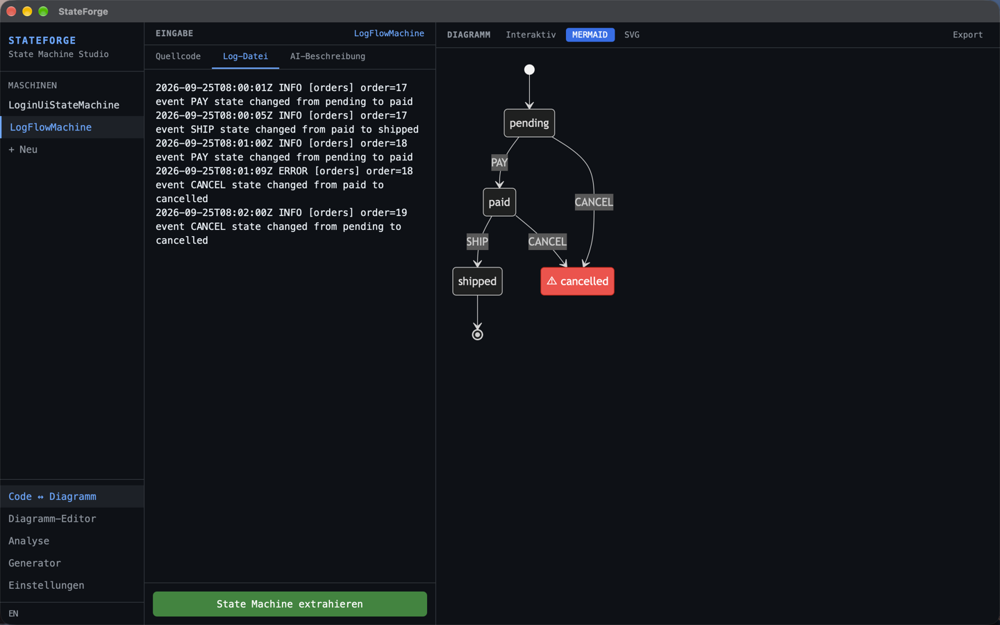

<div align="center">
  

  <h1>StateForge</h1>
</div>

[🇬🇧 English Version](README.md)

**Automatische State-Machine-Generierung aus Code, Logs und UI-Flows, entwickelt mit Rust und Tauri.**

StateForge extrahiert automatisch State Machines aus Quellcode, Log-Dateien, API-Sequenzen oder natürlichsprachigen Beschreibungen und stellt diese als interaktive Diagramme dar. Es hilft, komplexe Abläufe zu verstehen, automatisch zu dokumentieren und sauberen State-Machine-Code in der Zielsprache zu regenerieren.

[](https://github.com/9t29zhmwdh-coder/StateForge/actions) [](https://github.com/9t29zhmwdh-coder/StateForge/security/code-scanning) [](https://securityscorecards.dev/viewer/?uri=github.com/9t29zhmwdh-coder/StateForge)

     

> **So läuft es:** StateForge ist eine native Desktop-App, kein Server oder Browser-Tool. Sie öffnet sich als eigenes Fenster, ohne Tray-Icon oder Hintergrunddienst; sie extrahiert und rendert nur, während das Fenster geöffnet ist.



---

> 💾 **Download:** [macOS (DMG)](https://github.com/9t29zhmwdh-coder/StateForge/releases/latest/download/StateForge.dmg) · [Windows (Installer)](https://github.com/9t29zhmwdh-coder/StateForge/releases/latest/download/StateForge-Setup.exe) · [Linux (AppImage)](https://github.com/9t29zhmwdh-coder/StateForge/releases/latest/download/StateForge.AppImage): immer die neueste Version, nicht codesigniert/notarisiert (Gatekeeper/SmartScreen warnen beim ersten Start). Oder aus dem Quellcode bauen, siehe Getting Started unten.

---

> 🌱 Neu hier? → [Schritt-für-Schritt-Anleitung für Einsteiger](GETTING_STARTED.md)

---

Die Oberfläche von StateForge ist auf Englisch (Standard) und Deutsch verfügbar, umschaltbar über den Sprachtoggle.

**In der Praxis:** du fügst Quellcode, eine Logdatei oder eine natürlichsprachige Beschreibung ein, StateForge extrahiert ein State-Machine-Modell und stellt es als interaktives Diagramm dar, das du bearbeiten und als Mermaid, DOT, SVG oder generierten Code in fünf Sprachen exportieren kannst.

## Funktionen

| Funktion | Beschreibung |
|---|---|
| **Code-Parser** | Extrahiert State Machines aus Swift, Kotlin, TypeScript, Go, Rust |
| **Log-Analyzer** | Rekonstruiert Zustandsflüsse aus Log-Dateien (JSON, Plaintext, Nginx, Syslog) |
| **Diagramm-Engine** | Rendert Mermaid, GraphViz DOT, SVG, interaktives React Flow |
| **Code-Generator** | Generiert idiomatischen State-Machine-Code in 5 Sprachen |
| **KI-Integration** | Claude (Anthropic API): Maschinen anreichern oder aus Beschreibung erstellen |
| **Plugin-System** | Erweiterbar mit eigenen Parsern via Rust-Trait |

> **Hinweis:** In den Einstellungen gibt es eine Ollama-Option und einen "Auto-KI-Anreicherung"-Schalter, aber keins von beidem ist angebunden; KI-Funktionen nutzen aktuell unabhängig von der Backend-Einstellung immer Claude, und die Anreicherung erfolgt immer manuell (siehe [ROADMAP.md](ROADMAP.md)).

---

## Voraussetzungen

- [Rust](https://rustup.rs/) 1.77+
- [Node.js](https://nodejs.org/) 20+
- [Tauri CLI v2](https://tauri.app/): `cargo install tauri-cli`
- Ein [Anthropic API-Key](https://console.anthropic.com/) (nur für die KI-Funktionen zum Anreichern/Erstellen aus Beschreibung nötig)
- macOS / Windows / Linux

---

## Schnellstart

```bash
git clone https://github.com/9t29zhmwdh-coder/StateForge
cd StateForge

cd frontend && npm install && cd ..
cargo tauri dev
```

### Verwendung

1. **Importieren**; Quellcode einfügen, eine Log-Datei laden oder den Ablauf in natürlicher Sprache beschreiben
2. **Analysieren**; StateForge extrahiert Zustände, Transitionen, Events und Guards automatisch
3. **Visualisieren**; Drag-and-Drop-Diagrammeditor mit Live-Sync zum extrahierten Modell
4. **Generieren**; Sauberen State-Machine-Code in Swift, Kotlin, TypeScript, Go oder Rust exportieren

---

## Deinstallation / Aufräumen

- App-Bundle löschen
- Lokale Datenbank entfernen: plattformspezifisches App-Datenverzeichnis (`stateforge.db`), aufgelöst über Tauris `app_data_dir`
- Gespeicherten API-Key aus der Schlüsselbundverwaltung.app entfernen (suche nach "stateforge")

Es bleiben keine weiteren Dateien oder Hintergrunddienste zurück.

---

## Unterstützte Eingaben

| Eingabe | Formate |
|---|---|
| **Swift** | Enums, TCA Reducer, `@Observable` / `@Published` |
| **Kotlin** | Sealed Classes, `when`-Ausdrücke, ViewModel-State |
| **TypeScript** | XState `createMachine`, Union Types, Redux Reducer |
| **Go** | iota-Konstanten, Switch-FSMs, `SetState()` / `Transition()` |
| **Logs** | key=value, JSON, Nginx, Docker, Syslog |

---

## Diagrammformate

| Format | Anwendungsfall |
|---|---|
| Interaktiv (React Flow) | Drag-and-Drop-Bearbeitung, Live-Sync |
| Mermaid stateDiagram-v2 | Markdown-Docs, GitHub |
| GraphViz DOT | Erweitertes Layout, CI-Pipelines |
| SVG | Eigenständiger Export, Präsentationen |

---

**Autor:** [Rafael Yilmaz](https://github.com/9t29zhmwdh-coder) · **Status:** Active ·  · **Lizenz:** MIT
