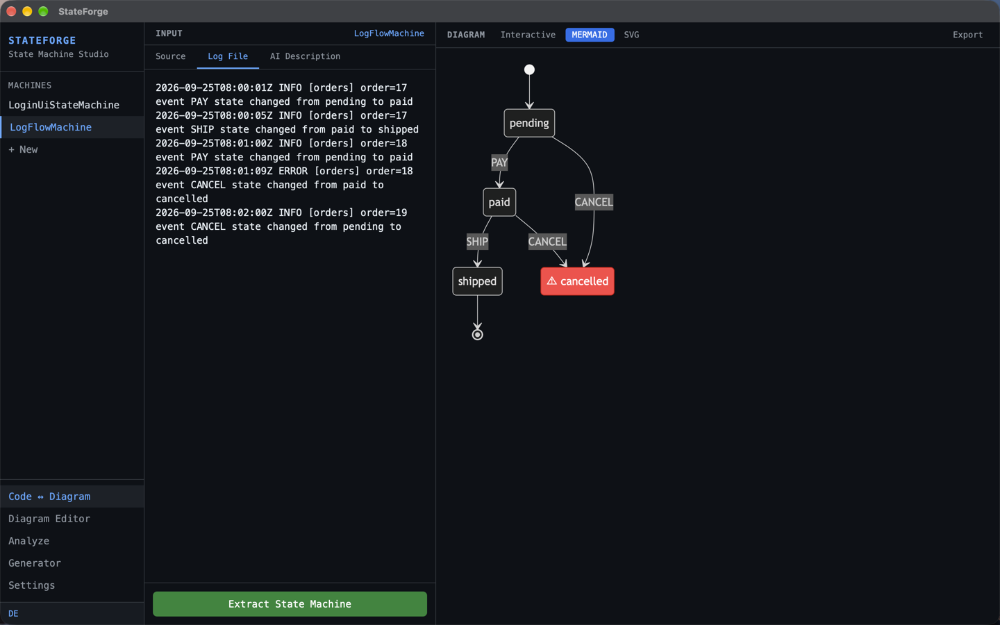

<div align="center">
  

  <h1>StateForge</h1>
</div>

[🇩🇪 Deutsche Version](README.de.md)

**Automatic state machine generation from code, logs and UI flows, built with Rust and Tauri.**

StateForge automatically extracts state machines from source code, log files, API sequences, or natural language descriptions and visualizes them as interactive diagrams. It helps you understand complex flows, document them automatically, and regenerate clean state machine code in your target language.

[](https://github.com/9t29zhmwdh-coder/StateForge/actions) [](https://github.com/9t29zhmwdh-coder/StateForge/security/code-scanning) [](https://securityscorecards.dev/viewer/?uri=github.com/9t29zhmwdh-coder/StateForge)

     

> **How it runs:** StateForge is a native desktop app, not a server or browser tool. It opens as its own window and has no tray icon or background service; it only extracts and renders while the window is open.



---

> 💾 **Download:** [macOS (DMG)](https://github.com/9t29zhmwdh-coder/StateForge/releases/latest/download/StateForge.dmg) · [Windows (Installer)](https://github.com/9t29zhmwdh-coder/StateForge/releases/latest/download/StateForge-Setup.exe) · [Linux (AppImage)](https://github.com/9t29zhmwdh-coder/StateForge/releases/latest/download/StateForge.AppImage): always the latest release, not code-signed/notarized (Gatekeeper/SmartScreen will warn on first run). Or build from source, see Getting Started below.

---

> 🌱 New here? → [Step-by-step guide for beginners](GETTING_STARTED.md)

---

StateForge's UI is available in English (default) and German; switch anytime with the language toggle.

**In practice:** you paste source code, a log file, or a natural-language description, StateForge extracts a state machine model and renders it as an interactive diagram you can edit, then export as Mermaid, DOT, SVG, or generated code in five languages.

## Features

| Feature | Description |
|---|---|
| **Code Parser** | Extracts state machines from Swift, Kotlin, TypeScript, Go, Rust |
| **Log Analyzer** | Reconstructs state flows from log files (JSON, plaintext, nginx, syslog) |
| **Diagram Engine** | Renders Mermaid, GraphViz DOT, SVG, interactive React Flow |
| **Code Generator** | Generates idiomatic state machine code in 5 languages |
| **AI Integration** | Claude (Anthropic API): enhance machines or create from natural language |
| **Plugin System** | Extend with custom parsers via Rust trait |

> **Note:** Settings includes an Ollama option and an "Auto AI Enhance" toggle, but neither is wired up yet; AI features currently always use Claude regardless of the backend setting, and enhancement is always manual (see [ROADMAP.md](ROADMAP.md)).

---

## Requirements

- [Rust](https://rustup.rs/) 1.77+
- [Node.js](https://nodejs.org/) 20+
- [Tauri CLI v2](https://tauri.app/): `cargo install tauri-cli`
- An [Anthropic API key](https://console.anthropic.com/) (only needed for the AI enhance/generate-from-description features)
- macOS / Windows / Linux

---

## Quick Start

```bash
git clone https://github.com/9t29zhmwdh-coder/StateForge
cd StateForge

cd frontend && npm install && cd ..
cargo tauri dev
```

### Usage

1. **Import**; paste source code, a log file, or describe your flow in natural language
2. **Analyze**; StateForge extracts states, transitions, events, and guards automatically
3. **Visualize**; drag-and-drop diagram editor with live sync to the extracted model
4. **Generate**; export clean state machine code in Swift, Kotlin, TypeScript, Go, or Rust

---

## Uninstall / Cleanup

- Delete the app bundle
- Remove the local database: platform-specific app data directory (`stateforge.db`), resolved via Tauri's `app_data_dir`
- Remove the stored API key from Keychain Access.app (search for "stateforge")

No other files or background services are left behind.

---

## Supported Inputs

| Input | Formats |
|---|---|
| **Swift** | Enums, TCA Reducers, `@Observable` / `@Published` |
| **Kotlin** | Sealed classes, `when` expressions, ViewModel state |
| **TypeScript** | XState `createMachine`, union types, Redux reducers |
| **Go** | iota constants, switch FSMs, `SetState()` / `Transition()` |
| **Logs** | key=value, JSON, Nginx, Docker, Syslog |

---

## Diagram Formats

| Format | Use Case |
|---|---|
| Interactive (React Flow) | Drag-and-drop editing, live sync |
| Mermaid stateDiagram-v2 | Markdown docs, GitHub |
| GraphViz DOT | Advanced layout, CI pipelines |
| SVG | Self-contained export, presentations |

---

**Author:** [Rafael Yilmaz](https://github.com/9t29zhmwdh-coder) · **Status:** Active ·  · **License:** MIT
